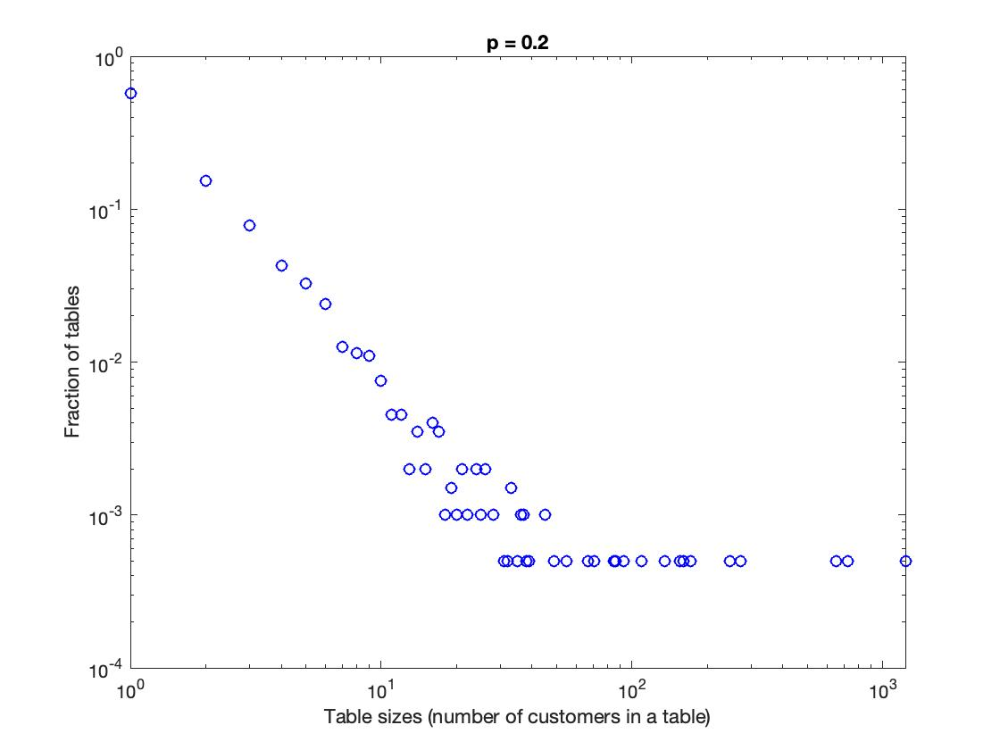
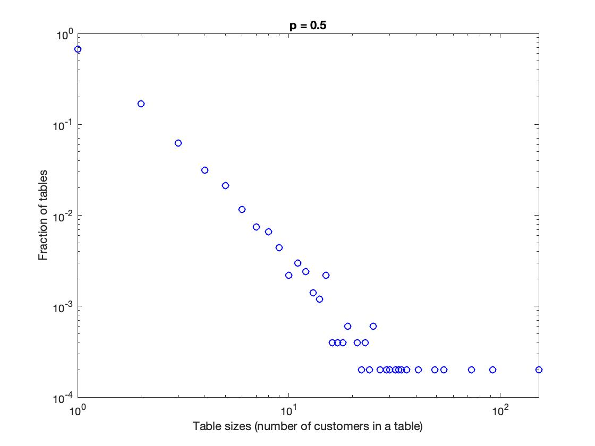
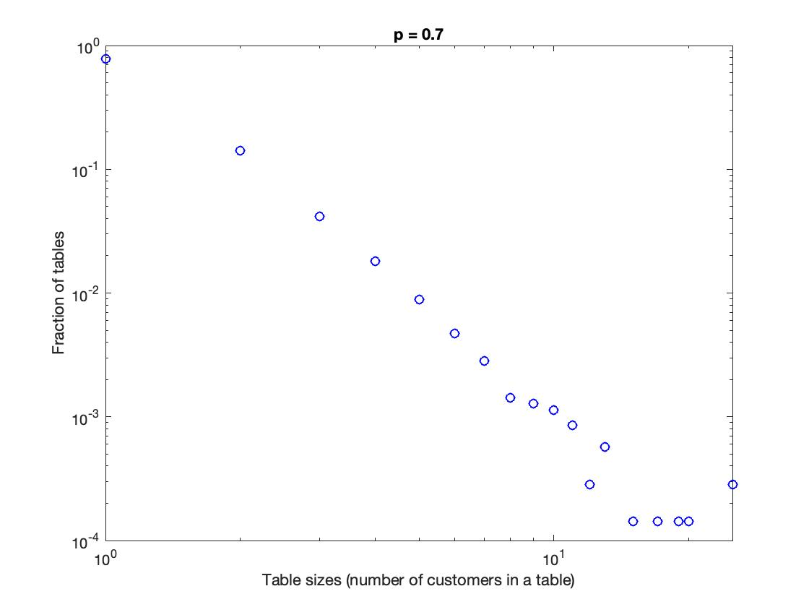

# Chinese Restaurant Process
This is a study on the preferential-attachment dynamics of networks, using a toy rich-gets-richer scenario.

## Problem Statement
Consider a (Chinese) restaurant with an infinite number of tables. Customers arrive at the restaurant one at a time at t = 1, 2, ... and the food is so good that no one leaves. Upon arrival, a new customer faces two choices: (i) with probability p she decides to open a new table; and (ii) otherwise (i.e., with probability 1 − p) she will join a table with k customers, with probability proportional to k. 

Suppose that initially there is a single open table with one customer. It turns out that the aforementioned Chinese restaurant process models preferential-attachment (i.e., rich-gets-richer) dynamics. Accordingly, the probability distribution of the size of the tables exhibits a power-law tail. The goal of this problem is to simulate this random process and verify its properties.

## Simulation
The function **chinese_restaurant.m** simulates the Chinese restaurant process. The function accepts as parameters the probability p of opening a new table, and the number of customers T (simulation’s time horizon). The function returns a vector of length at most T with the table sizes, and another vector whose k-th entry is the fraction of tables with k customers.

## Verifying Power-law Tail Distributions
The script **main_.m** plots of the distribution of table size in log-log scale for T = 10,000 and p = 0.2, p = 0.5 and p = 0.7. The plots are given at the end of this document.

## Installation and Usage
The scripts do not use any library beyond the default installations on MATLAB. Please run the **main_.m** script from the MATLAB interface, which will construct the desired plots. 

## Outputs

